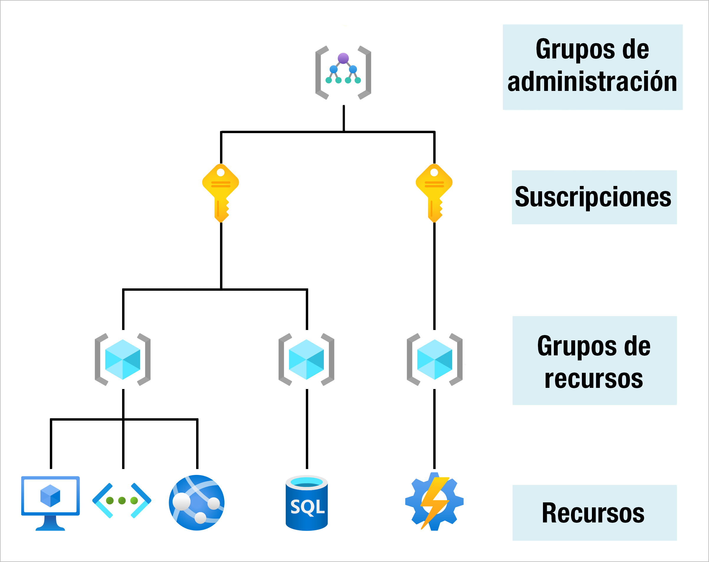

### ¿Qué es la Computación en la Nube? 
El cloud computing consiste en usar servicios y recursos informáticos de un proveedor como `Microsoft Azure`, `Amazon Web Services (AWS)` o `Google Cloud Platform (GCP)`. Suelen tener un modelo de pago por uso y permiten alquilar servicios de almacenamiento, redes y máquinas virtuales.

### Servicios
- Maquinas virtuales:
Las máquinas virtuales emulan un servidor. Es un equipo informático aislado con un sistema operativo Linux o Windows y un hardware limitado. Sobre una máquina virtual podremos instalar el software que necesitemos y configurarlo a nuestro gusto. Ofrecen un control total sobre el sistema operativo.
Las máquinas virtuales son una parte de un servidor compartido remoto. Esta virtualización se asegura de aislar y securizar cada máquina virtual para que sea un sistema independiente. Además, aportan numerosas ventajas, ya que se pueden desplegar muy rápido, hacer copias de seguridad y redimensionar fácilmente.

- Contenedores:
En los proveedores cloud también podemos desplegar contenedores. La plataforma más popular es Docker. Estos contenedores nos permiten ejecutar entornos sin sistema operativo integrado para ejecutar nuestras aplicaciones de forma portable o crear arquitecturas de microservicios. En Azure, el servicio PaaS llamado Azure Container Instances nos permite ejecutar de forma sencilla estos contenedores. También ofrecen servicios de orquestación de contenedores como Kubernetes. Este servicio se denomina EKS o Elastic Kubernetes Service en AWS y AKS o Azure Kubernetes Service en Azure.

- Serverless:
En este caso, el proveedor se encarga de proporcionar de forma transparente los recursos necesarios. Generalmente, estas funciones se ejecutan como respuesta a eventos como peticiones REST o temporizadores. Las funciones no contienen estado, cada vez que se ejecutan lo hacen desde cero. En el caso de que queramos mantener algún estado o persistencia deberemos conectar servicios externos como bases de datos o cuentas de almacenamiento. En AWS esta funcionalidad se denomina Lambda y en la plataforma de Azure se denominan Azure Functions. Por otro lado, Azure Lo

## grupos de administración y los recursos de Azure

Una vez vista la jerarquía vertical de la organización, describamos cada uno de estos niveles empezando desde abajo:

* # Recursos: Los recursos son instancias de servicios que puede crear, como máquinas virtuales, almacenamiento o bases de datos SQL.
* # Grupos de recursos: Los recursos se combinan en grupos de recursos, que actúan como contenedor lógico en el que se implementan y administran recursos de Azure como aplicaciones web, bases de datos y cuentas de al3macenamiento.
* # Suscripciones: Una suscripción agrupa las cuentas de usuario y los recursos que han creado esas cuentas de usuario. Para cada suscripción, hay límites o cuotas en la cantidad de recursos que se pueden crear y usar. Las organizaciones pueden usar las suscripciones para administrar los costos y los recursos creados por los usuarios, equipos o proyectos.
* # Grupos de administración: Estos grupos le ayudan a administrar el acceso, las directivas y el cumplimiento de varias suscripciones. Todas las suscripciones de un grupo de administración heredan automáticamente las condiciones que se aplican al grupo de administración.

